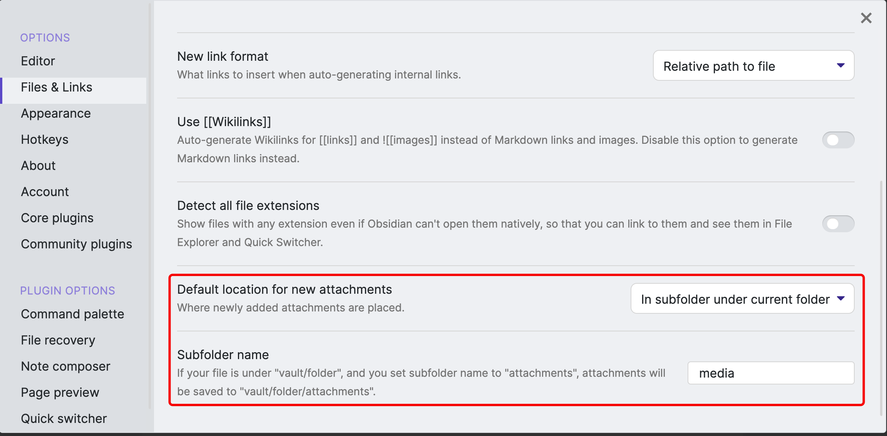

## obsidian configuire
### Attachments
Define the paste position


### png markdown format

### Hotkeys
**Preview/Source mode**


###  Community plugins
- Advanced Tables

### themes
- Obsidian you


### img to network
```bash
find ./ -name "*png"  # result copy to network

grep -R "Pasted%20image" .  # 查找粘贴的图片替换 或者通过vscode、sublime等工具替换
```